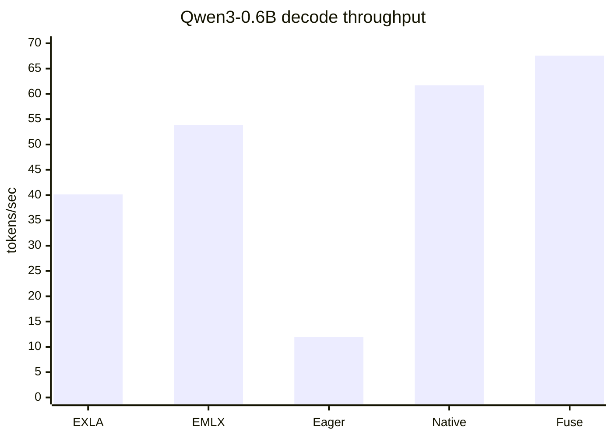
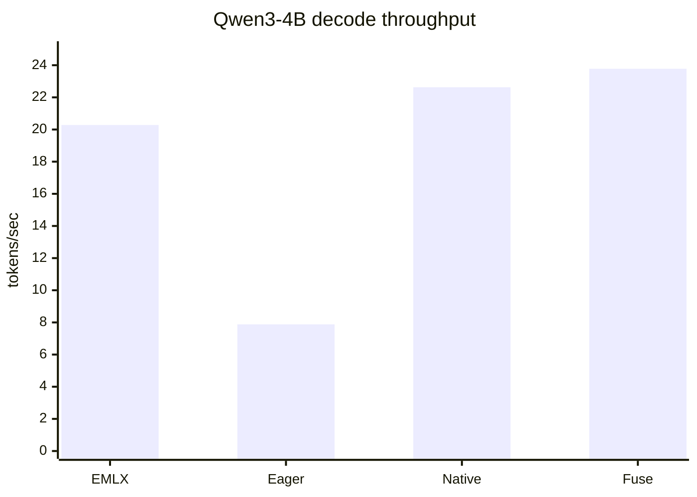
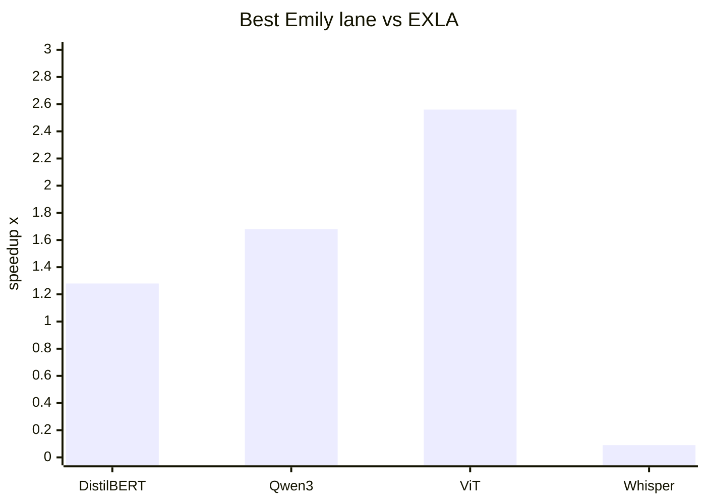
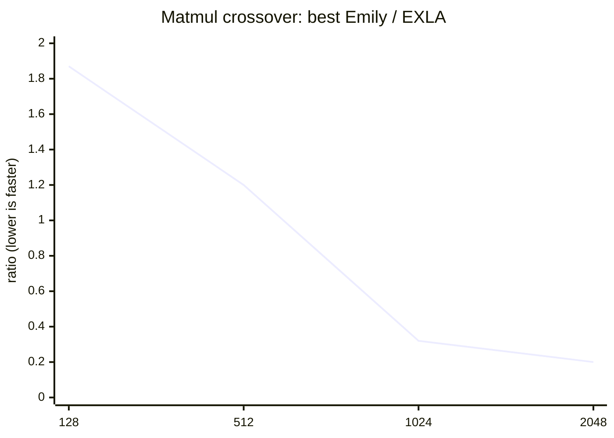

# Emily vs EMLX vs EXLA - performance comparison

This report compares Emily against two Nx backend baselines:

* **EXLA**: XLA host/CPU backend on Apple Silicon.
* **EMLX**: MLX-backed Nx backend on the Metal GPU.
* **Emily**: local MLX/Metal backend, reported across eager, native, and fuse
  lanes. For conclusions, use the best Emily lane for the workload.

Harness: `bench/emily_vs_exla.exs`. Raw generated numbers:
[`bench/emily_vs_exla_results.md`](emily_vs_exla_results.md). Large-model
GPU-focused addendum: `bench/qwen3_4b_emily_vs_emlx.exs`.

## Performance overview

The main benchmark suite runs five lanes in every tier: `exla`, `emlx`,
`emily-eager`, `emily-native`, and `emily-fuse`.

Those lanes provide two complementary baselines:

| Baseline | Question answered |
| --- | --- |
| EXLA CPU | Is MLX/Metal GPU faster than XLA host CPU for this workload? |
| EMLX GPU | Is Emily's compiler/runtime faster than the other MLX-backed Nx stack? |

The focused Qwen3-4B script includes an EXLA lane for explicit experiments, but
its default run is GPU-only. On this 24 GB M4 Pro, Qwen3-4B bf16 on EXLA-CPU was
killed by the OS during compile/run. The completed, canonical three-way Qwen
comparison is therefore Qwen3-0.6B in the main suite.

## Environment

Run on an Apple M4 Pro MacBook Pro with 24 GB RAM.

| Component | Version / backend |
| --- | --- |
| Elixir / OTP | 1.19.5 / 28 |
| Nx | 0.12.1 |
| Emily | 1.0.0 local checkout |
| EMLX | 0.4.1, Metal GPU |
| EXLA | 0.12.0, host CPU client |

## Changes since the emlx 0.3.1 run (2026-06-13)

EMLX 0.4 is a major performance upgrade over 0.3.1, and it reshapes the
Emily-vs-EMLX story. On the tiers EMLX completes, its times roughly halved
(DistilBERT 19.19 ms -> 9.97 ms) or better (Qwen3-0.6B decode 11.42 -> 53.81
tok/s, Qwen3-4B 7.33 -> 20.28 tok/s). The EXLA and Emily lanes moved only a few
percent between runs, so the delta is the emlx upgrade itself, not machine
drift.

Concretely, best-Emily-vs-EMLX went from 2.72x to 1.44x on DistilBERT, from
5.82x to 1.26x on Qwen3-0.6B decode, and from 3.20x to 1.17x on the Qwen3-4B
addendum. EMLX 0.4.1 still does not complete the ViT-base or Whisper-tiny
tiers in this harness.

## Executive summary

Emily's best lane wins the main model tiers that are GPU-friendly:

| Tier | EXLA | EMLX | Best Emily | Best lane | vs EXLA | vs EMLX |
| --- | ---: | ---: | ---: | --- | ---: | ---: |
| DistilBERT QA | 8.89 ms | 9.97 ms | 6.94 ms | fuse | 1.28x faster | 1.44x faster |
| Qwen3-0.6B decode | 40.15 tok/s | 53.81 tok/s | 67.57 tok/s | fuse | 1.68x faster | 1.26x faster |
| ViT-base image classification | 55.88 ms | ERR | 21.79 ms | fuse | 2.56x faster | n/a |
| Whisper-tiny transcription | 87.83 ms | ERR | 928.35 ms | native | 10.6x slower | n/a |

The Qwen3-4B addendum on the largest practical Bumblebee model for this
machine:

| Lane | Qwen3-4B tok/s | vs EMLX |
| --- | ---: | ---: |
| EMLX | 20.28 | 1.00x |
| Emily eager | 7.88 | 0.39x |
| Emily native | 22.63 | 1.12x |
| Emily fuse | 23.78 | 1.17x |

The headline is still: **Emily's compiler path is the differentiator** — but
the shape has changed with emlx 0.4. EMLX's own compiled lane now decisively
beats op-by-op execution (including Emily's eager lane) on decode, so the
contest is compiler-vs-compiler, and Emily native/fuse hold a consistent
1.2-1.4x lead on every tier both stacks complete.

## Visual summary









## Tier 1 - op microbenchmarks

The op tier is still a latency/throughput crossover story. EXLA CPU wins the
small launch-bound cases, while MLX/Metal wins once the tensors are large enough
to amortize dispatch and kernel launch overhead.

Examples from the fresh run:

| Op | Size | Winner | Signal |
| --- | ---: | --- | --- |
| add | 256 | EXLA | best Emily is 2.08x slower than EXLA |
| add | 4096 | Emily | best Emily is 2.2x faster than EXLA |
| exp | 4096 | Emily | best Emily is 3.3x faster than EXLA |
| softmax | 4096 | Emily/EMLX tie | both MLX lanes are ~2.6x faster than EXLA |
| matmul | 2048 | Emily/EMLX tie | both MLX lanes are about 5x faster than EXLA |

Against EMLX, Emily's best op lane is usually close: sometimes a little faster,
sometimes a little slower. Per-op parity is expected — both stacks dispatch the
same MLX kernels — so the EMLX-vs-Emily separation appears in traced model
execution, where compiler and dispatch strategy differ.

## Tier 2 - DistilBERT QA

DistilBERT is a three-way win for Emily native/fuse:

| Lane | ms/call |
| --- | ---: |
| EXLA CPU | 8.89 |
| EMLX GPU | 9.97 |
| Emily eager | 14.82 |
| Emily native | 7.02 |
| Emily fuse | 6.94 |

Native and fuse are within a few percent of each other here; either is the
right Emily option for a single-forward workload. The EMLX lane roughly halved
its 0.3.1 time but showed high run-to-run variance in this run (11.7 / 12.4 /
5.8 ms), so treat its mean with some caution.

## Tier 3 - Qwen3-0.6B decode

Qwen3-0.6B is the canonical completed three-way generation benchmark:

| Lane | tok/s |
| --- | ---: |
| EXLA CPU | 40.15 |
| EMLX GPU | 53.81 |
| Emily eager | 11.96 |
| Emily native | 61.70 |
| Emily fuse | 67.57 |

The 0.4 emlx lane now comfortably beats both EXLA-CPU and Emily's eager lane —
op-by-op decode is simply not competitive from either stack. Emily native/fuse
stay ahead at 1.15-1.26x over EMLX. Fuse is the best choice for decode loops.

## Tier 4 - ViT-base image classification

ViT-base strongly favors Emily:

| Lane | ms/call |
| --- | ---: |
| EXLA CPU | 55.88 |
| EMLX GPU | ERR |
| Emily eager | 35.58 |
| Emily native | 23.96 |
| Emily fuse | 21.79 |

This tier is GPU-friendly: larger matrix multiplies and enough work per forward
for the GPU path to dominate. The EMLX lane did not complete in this harness
(on 0.3.1 or 0.4.1), so the meaningful comparison here is Emily vs EXLA.

## Tier 5 - Whisper-tiny transcription

Whisper-tiny remains Emily's bad case:

| Lane | ms/call |
| --- | ---: |
| EXLA CPU | 87.83 |
| EMLX GPU | ERR |
| Emily eager | 1920.57 |
| Emily native | 928.35 |
| Emily fuse | 955.36 |

This is not a coverage win for EXLA; the Emily lanes reported zero fallbacks in
the live run. It is a workload-shape problem: Whisper-tiny is made of many small
kernels where CPU launch overhead and cache locality beat GPU dispatch. Native
cuts eager roughly in half, but still cannot remove the underlying small-kernel
cost. Fuse does not help this workload. The EMLX lane did not complete this
tier on 0.3.1 or 0.4.1.

## Qwen3-4B addendum

The focused Qwen3-4B script's safe default remains GPU-only:

```sh
elixir bench/qwen3_4b_emily_vs_emlx.exs
```

Fresh result (emlx 0.4.1):

| Lane | mean tok/s | min | max | vs EMLX |
| --- | ---: | ---: | ---: | ---: |
| EMLX | 20.28 | 20.07 | 20.44 | 1.00x |
| Emily eager | 7.88 | 7.81 | 7.97 | 0.39x |
| Emily native | 22.63 | 22.61 | 22.64 | 1.12x |
| Emily fuse | 23.78 | 23.55 | 23.97 | 1.17x |

All four lanes produced the identical greedy completion, so the throughput
comparison is on the same decode. Note the Emily lanes are essentially
unchanged from the 0.3.1-era run (native 22.27 -> 22.63, fuse 23.46 -> 23.78)
while EMLX jumped 7.33 -> 20.28 tok/s.

An explicit EXLA smoke attempt on Qwen3-4B:

```sh
EMILY_BENCH_NEW_TOKENS=4 EMILY_BENCH_RUNS=1 EMILY_BENCH_WARMUP=0 \
  EMILY_BENCH_LANES=exla,emlx,emily-fuse \
  elixir bench/qwen3_4b_emily_vs_emlx.exs
```

loaded Qwen3-4B on `EXLA.Backend` as `:bf16`, then the process was killed with
exit 137 during the EXLA compile/run. That is why the default 4B addendum is not
used as the canonical three-way comparison on this 24 GB machine.

## Recommendations

Use `emily-fuse` for autoregressive decode loops. It is best on Qwen3-0.6B and
Qwen3-4B because the loop body is reused.

Use `emily-native` or `emily-fuse` for single-forward model workloads — they
are within a few percent of each other on DistilBERT and ViT. Fuse's edge grows
when a compiled body is reused, as in decode.

Avoid op-by-op execution for decode from either stack: Emily eager and
pre-compiler EMLX both sit near 12 tok/s on Qwen3-0.6B where the compiled lanes
reach 54-68 tok/s.

Keep EXLA out of the default Qwen3-4B run on 24 GB machines. The EXLA 4B smoke
was killed by the OS, while Qwen3-0.6B gives a completed three-way generation
comparison.

Investigate Whisper separately with profiler traces. The model lowers, but its
small-kernel shape is hostile to the current GPU path.
